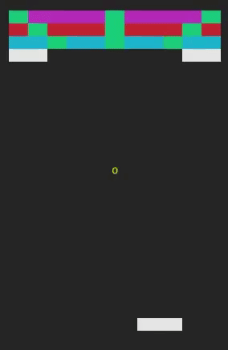

# ASCII BrickBreaker
Smash your way through the preset levels with the help of quirky and entertaining powerups. If the preset levels aren't challenging enough, feel free to create your own levels and test your skills. 


### How to start the game
Start up the game by running 
```
python3 main.py
```
in the directory where main.py is present.

### Controls
The controls are like most other 2D games, use 'A' and 'D' to move the paddle left and right, and space to release the ball. Additionally, use 'N' to skip a level if you wish to forfeit and try out the next level. 
Each brick on destruction may spawn a powerup that can help or hinder your gameplay which you can collect by navigating your paddle to be underneath it. 

**Shrink Paddle (S)**: 

This powerup decreases the paddle size giving the player a smaller surface to play with. 

**Grow Paddle (G)**:

This powerup increases the paddle size giving the player a larger surface to play with  

**Fast Ball (F)**:

This powerup increases the speed of the ball. 

**Paddle Grab (P)**:

This powerup gives the paddle the ability to make the ball stick to it, and release it at any point in time using the space key. 

**Thru Ball (T)**:

This powerup gives the ball the ability to phase through bricks, instantly destroying them (including the previously unbreakable bricks).

**Laser Paddle (L)**:

This powerup gives the paddle the ability to automatically fire lasers from its ends. The lasers damage the bricks the same way a ball would. 

**Fire Ball (E)**:

This powerup gives the ball an exploding property, and has the same effect as an exploding brick. 

### Modifications
The levels are drawn from the ```level<i>.dat``` file present in the ```levels```directory. It is fairly simple to create a map to play on, simply use 1-3 to represent bricks of varying strength, 0 to represent free space, 4 to represent unbreakable bricks, 5 to represent exploding bricks and 6 to represent rainbow bricks. You could also choose to include a UFO in the game (makes it a lot more difficult) by entering a U in a level file (the UFO has some constraints, make sure there are no other bricks on the UFO level). 
To increase/decrease the number of playable levels, change the ```NUM_LEVELS``` value in the ```src/defs.py``` file (this should be done if you're testing new levels or simply want to expand/shrink the game).

The file defs.py also contains several definitions which can be changed to change gameplay. Most notably, the paddle length, speed, max lives, scoring features, powerup probability and powerup duration can be tweaked to make gameplay easier/harder. 